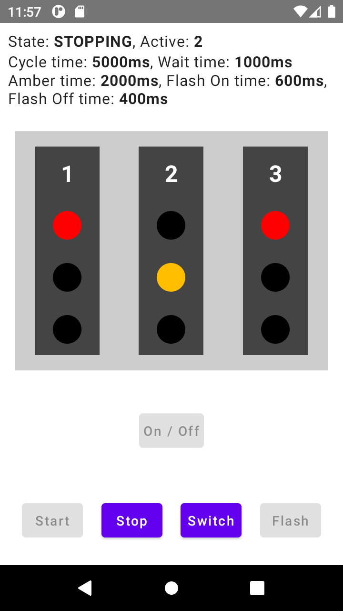
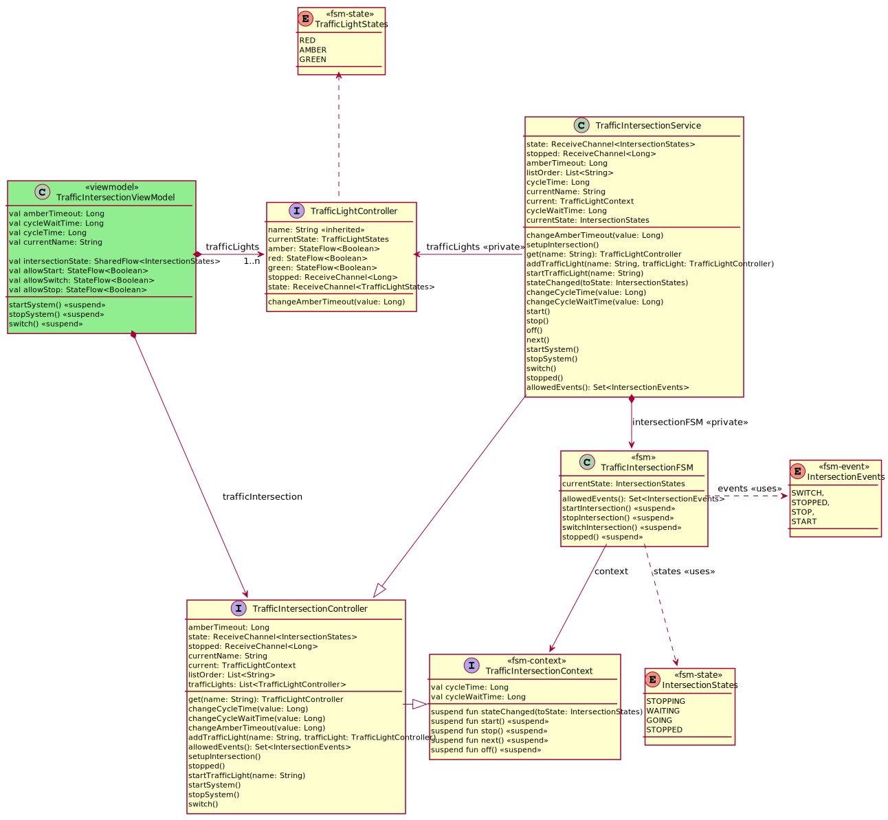
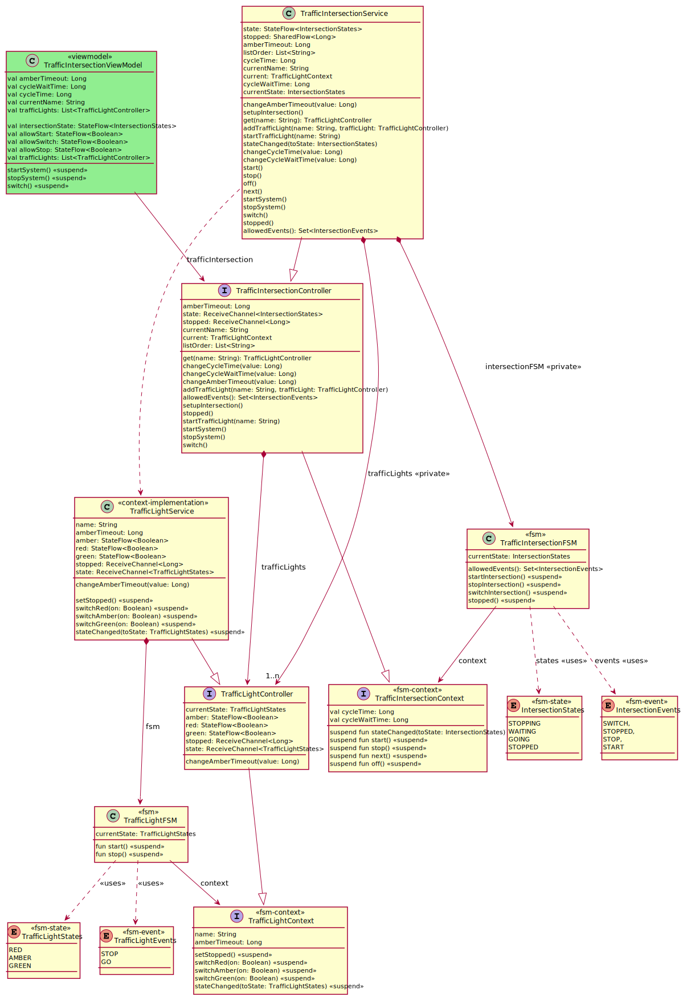

= KFSM MPP Compose Traffic Intersection Demo
:figure-caption!:

This project is an MPP version of https://github.com/open-jumpco/kfsm-android-compose-traffic[kfsm-android-compose-traffic]. It will be extended over time to test the extent of support for various UI mechanisms of Compose across Android, Desktop and Web.

== Screenshots

This application demonstrates using 2 state machines to provide a solution.
The traffic light state machine operates the light and only has a stop and go event. The stop event will switch to amber and after a timeout switch to red and generate a stopped notification.

The intersection state machine cycles through controlling the lights in order, sending go to current light and then waiting after stopped before switching to next light sending the go event.

The `TrafficIntersectionService` can be created by providing a different number of lights.

The application illustrates how to create a view models that uses `Channel` and `StateFlow` and `SharedFlow` to represent the changing values and states so that compose can update the UI efficiently. Using channels from the service means the ViewModel can decide which coroutine context to when updating the state flow after receiving from the channel.

== Description
We are using to completely separate finite state machines to manage the intersection. The intersection knows about the traffic lights and subscribes to a stop event in order to know when the cycle ends.
It can also be achieved with a timeout based on the knowledge of the amber timeout and wait time. However, we wanted to experiment with events.

=== Traffic light
* The traffic light can be turned on and off, it can be configured with amber timeout and flashing timeoutes.
* The traffic light can be started and stopped or turned to flashing.
* When it is turned on all lights are read.
* When it is started it will switch the active light to green.
* When it is stopped it will switch to amber and after timeout to red.
* Then it will generate a stopped event.

== Traffic Intersection
* The traffic intersection can be configured with a cycle time that determines how long the light is green and a wait time that determines how long the light is red before switching to the next light.
* The traffic intersection will switch between lights.
* Starting a light which turns it to green. Then after a timeout it will stop the light which turns it to amber and after timeout to red and then the light sends a stop event.
* The intersection will receive the stopped event and then wait for a period before switching to next light and then starting that light.

== Running

=== Desktop

[source,bash]
....
./gradlew :desktop run
....

=== Android

Launch the application using any AVD and let us know if you experience any problems.
The Android version should respond to orientation changes if your device or AVD is configured to change orientation automatically.

== Class Diagrams
=== Traffic Light classes

=== Traffic Intersection classes

=== Complete Traffic Intersection Class diagram

== Generated State diagrams

=== Simple Traffic Light State Diagram

image:traffic-light-simple.svg[Static]

=== Detailed Traffic Light State Diagram

image:traffic-light.svg[Static]

=== Traffic Light State map

include::generated/traffic-light.adoc[]

=== Simple Traffic Intersection State Diagram

=== Detailed Traffic Intersection State Diagram

=== Traffic Intersection State map
include::generated/traffic-intersection.adoc[]
